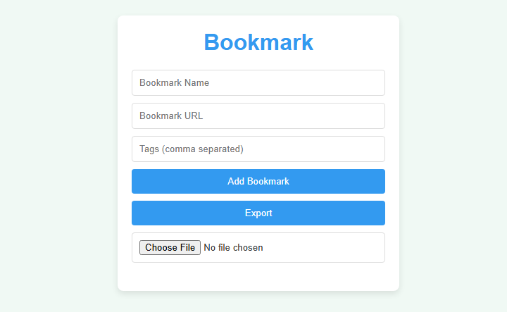

# 📑 Bookmark

A simple, elegant, and enhanced web app to save, view, and manage your favorite bookmarks. Built using **HTML**, **CSS**, and **JavaScript** — with zero dependencies.

## ✨ Features

- ✅ Add bookmark with **Name**, **URL**, and **Tags**
- ✅ URL validation (`http://` or `https://` required)
- ✅ Prevent **duplicate bookmarks**
- ✅ **Open** bookmarks in a new tab
- ✅ **Delete** bookmarks with confirmation
- ✅ Persistent storage via `localStorage`
- ✅ Import/Export bookmarks as `.json`
- ✅ Responsive, mobile-friendly UI

## 📸 Preview

 

## 🧠 How It Works

* Bookmarks are stored in your browser’s `localStorage`
* On page load, bookmarks are automatically rendered
* Favicon preview pulled from Google favicon API

## 📤 Export & Import Bookmarks

You can export your data to a `.json` file and re-import it later or on another device.

* Click **Export** to download `bookmarks.json`
* Use the file input to **Import** a saved file (must be valid JSON)

## 🔒 Data Privacy

All your data stays **on your device**. No internet, server, or account required.
